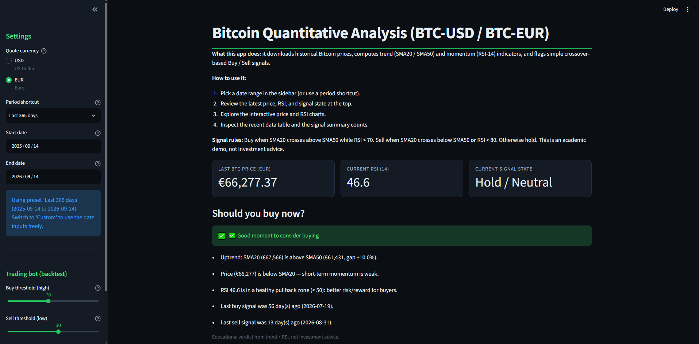
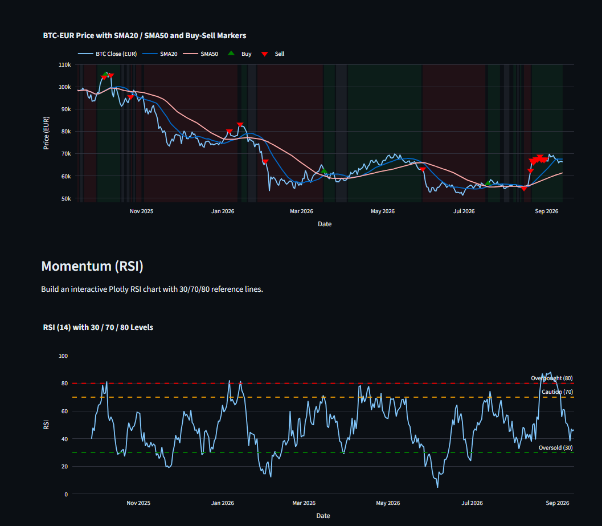

# BTC Quantitative Analysis — no API keys, everything explainable

[](requirements.txt)
[](https://streamlit.io)
[](tests/)
[](LICENSE)

Bitcoin trend + momentum analysis with an explainable bull/bear regime, a tunable
threshold bot with causal backtesting, and a news-sentiment ML pipeline that runs
**100% free — no API keys**. Built as a hiring portfolio piece: every decision is
documented in [`docs/DECISION_LOG.md`](docs/DECISION_LOG.md).




> Screenshots above are placeholders until the first capture — see
> “Updating the screenshots” below. Or run it yourself in 2 minutes (Quickstart).

**Live demo:** deploy free on [Streamlit Community Cloud](https://share.streamlit.io)
with `app.py` as the entry point, then put the URL here.

## What it does

- **Price engine** — SMA20/SMA50 trend, RSI-14 momentum and crossover signals (`indicators.py`, one source of truth).
- **Bull/bear regime** — a 0-100 score (trend ±30, momentum ±20, RSI, fresh signals, distance to 90-day high) with plain-language labels. The price chart background is tinted by regime.
- **Threshold bot** — hysteresis backtest (BUY ≥ high, SELL ≤ low), tunable in the sidebar and via CLI, benchmarked against buy & hold with win rate and max drawdown.
- **News sentiment (keyless)** — free RSS (CoinDesk, Cointelegraph, Bitcoin Magazine) labeled with 24h forward returns; TF-IDF + LogisticRegression with a strict temporal split.
- **Plain-language guide** — every acronym (SMA, RSI, F1, drawdown…) translated to Good/Neutral/Caution/Bad with your live values.
- **Dark trading-terminal theme** with 22 automated tests.

## Results (real data, 2026-09-14)

| Setup | Bot | Buy & hold |
|---|---|---|
| Full history, 4381 days, 70/30 | **+15 571%** (43 buys, max DD −72%) | +17 046% |
| Last 365 days, 70/30 | **+1.2%** (5 buys) | −32.1% |

News classifier (demo, 16 headlines, ±0.4% labels to get both classes): accuracy **25%**,
macro-F1 **0.20** — it fails, honestly documented in D8. The production model at ±2%
unlocks automatically once weekly runs accumulate 200+ labeled rows.

## Quickstart (2 minutes, Windows)

```bash
pip install -r requirements.txt
```

Double-click **`ver_app.bat`** — the app opens in your browser.
Double-click **`actualizar_datos.bat`** once a week — it refreshes news, prices,
dataset and retries training.

CLI equivalents:

```bash
python download_news_rss.py --append
python download_prices.py
python build_dataset.py --threshold 0.02
python train_model.py
python bot.py --buy 70 --sell 30 --capital 10000
python -m pytest tests/ -q
```

## How it works

```text
RSS feeds ──► news_btc.csv ──┐
                             ├─► dataset.csv ──► model.joblib ──► Streamlit app
yfinance ───► prices_btc.csv ┘         (BUY/SELL/HOLD ±2%)   (TF-IDF + LogReg)
```

No lookahead anywhere: regime scores use only data up to each day, the model trains
on the oldest 80% and is tested on the newest 20%, and the backtest recomputes scores
causally.

## Project structure

```text
app.py                Streamlit app (theme: .streamlit/, assets/terminal.css)
indicators.py         SMA/RSI/signals — single source of truth
bull_bear.py          regime score + chart bands
bot.py                threshold backtest (CLI + sidebar panel)
glossary.py           plain-language indicator guide
build_dataset.py      news × forward-return labeling (--threshold)
train_model.py        TF-IDF + LogReg trainer (--min-rows)
download_news_rss.py  keyless RSS collector (--append)
download_prices.py    yfinance prices
tests/                22 pytest tests
docs/DECISION_LOG.md  every engineering decision, with alternatives
```

## Roadmap

- [ ] Weekly data accumulation → production model at ±2% (automatic via GitHub Action)
- [ ] SMA200 long-cycle view for multi-month regimes
- [ ] Threshold heatmap (buy × sell sensitivity grid)

## Updating the screenshots

1. Run `ver_app.bat`, set the window to ~1400px wide.
2. Screenshot the top (metrics → regime → bot) as `docs/screenshots/1-overview.png`.
3. Scroll to the price chart with regime bands as `docs/screenshots/2-regime-bot.png`.

*Academic demo, not investment advice. Data: Yahoo Finance + free RSS.*
